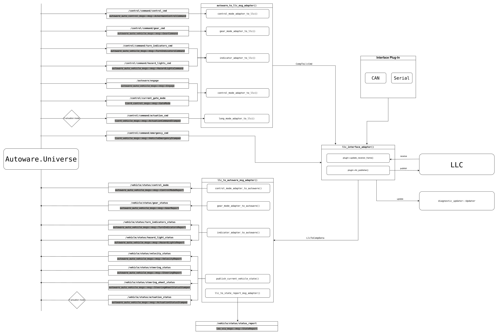

# leo_vcu_driver
`leo_vcu_driver` is the package to connect Autoware with LLC.
# Description

Purpose of this package is providing connection between Autoware Universe and Low Level Controller. LLC communication can communicate Serial or CAN interfaces.

# Design

Design of package was made with respect to `Autoware.Universe` design architecture.

# Parameters

| Name                                    | Type   | Description                                             |
|-----------------------------------------|--------|---------------------------------------------------------|
| `interface_mod`                         | string | interface mod, default [CAN]                            |
| `base_frame_id`                         | string | frame id, default [base_link]                           |
| `command_timeout_ms`                    | double | timeout [ms]                                            |
| `data_publish_rate`                     | double | rate to publish commands to LLC [Hz]                    |
| `reverse_gear_enabled`                  | bool   | enable reverse gear (True means Enabled)                |
| `gear_shift_velocity_threshold`         | float  | The maximum velocity to change gear [m/s]               |
| `max_steering_wheel_angle`              | float  | Maximum steering wheel angle [degree]                   |
| `min_steering_wheel_angle`              | float  | Minimum steering wheel angle [degree]                   |
| `max_steering_wheel_angle_rate`         | float  | Maximum steering angle rate [degree/sec]                |
| `check_steering_angle_rate`             | bool   | If enabled, node limits the steering wheel rate         |
| `enable_emergency`                      | bool   | If enabled, vcu driver can do emergency brake           |
| `emergency_stop_acceleration`           | float  | Acceleration parameter for emergency [m/s^2]            |
| `soft_stop_acceleration`                | float  | Acceleration parameter for soft stop [m/s^2]            |
| `add_emergency_acceleration_per_second` | float  | Acceleration parameter for emergency per second [m/s^2] |
| `enable_cmd_timeout_emergency`          | bool   | Enable emergency when timeout                           |
| `enable_long_actuation_mode`            | bool   | Enable actuation for gas-brake pedal controlling        |

# Future Improvements
